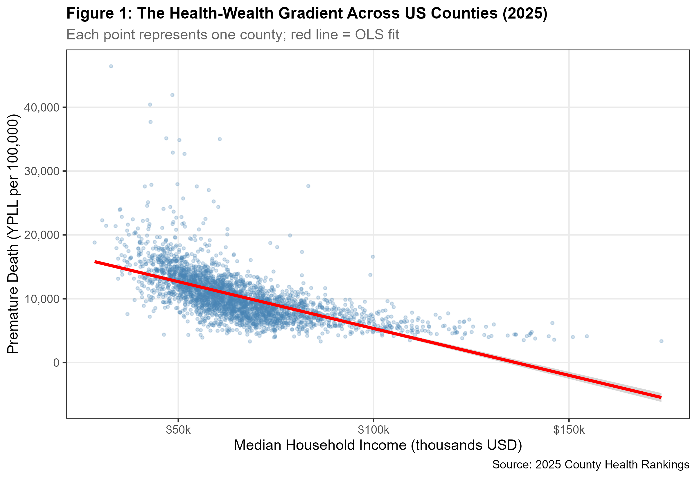
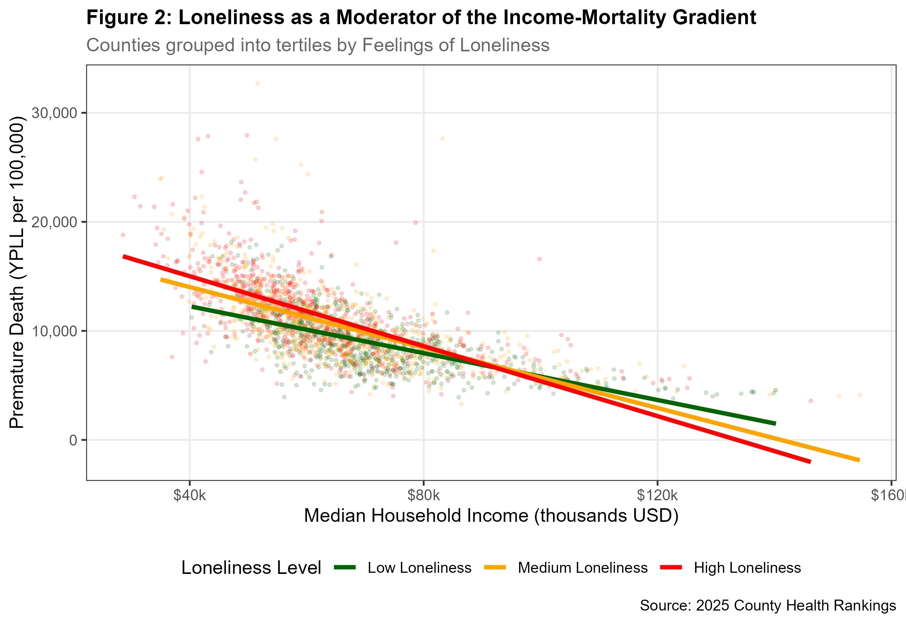
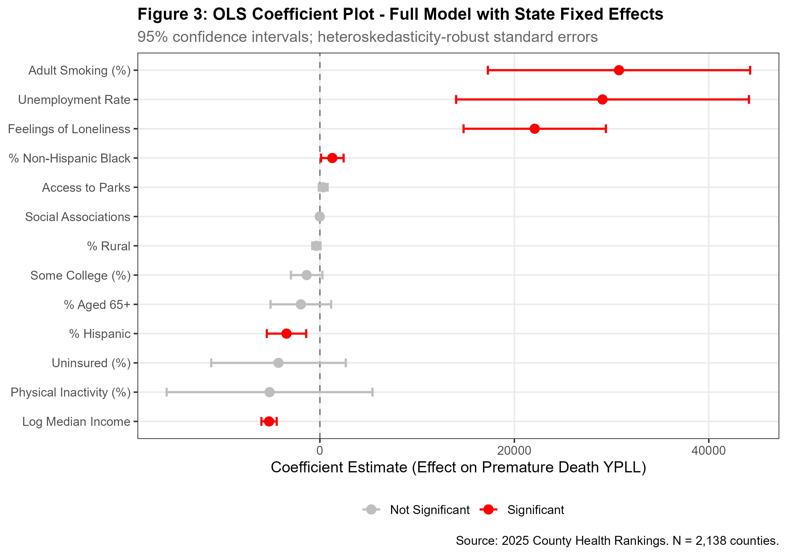
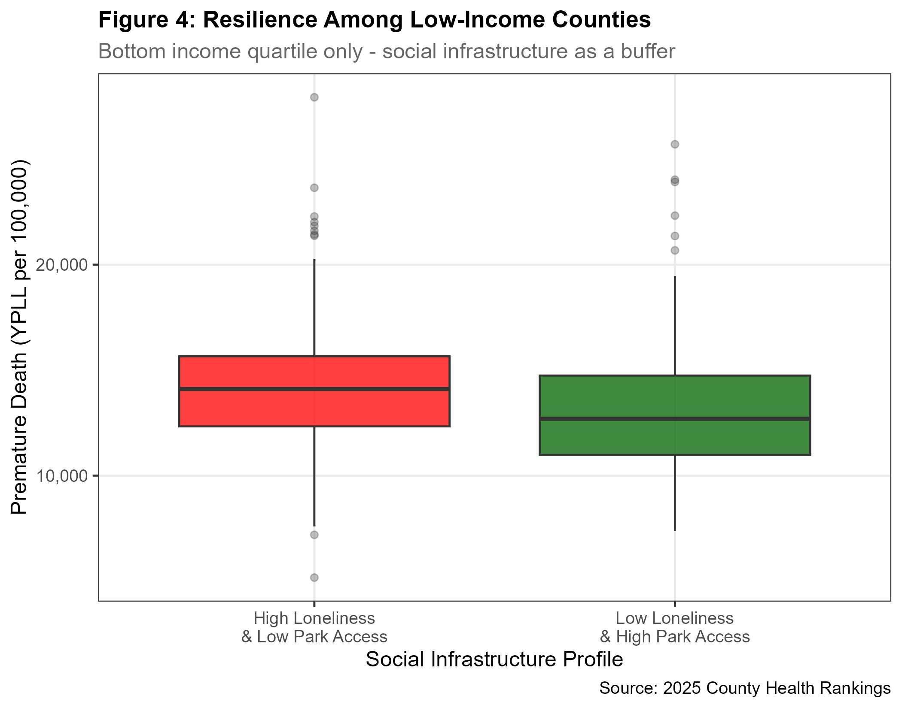

# Health-Wealth Gradient: Evidence from US Counties (2025)

## Overview
This project examines why some low-income US counties experience 
significantly lower premature death rates than equally poor neighbours. 
Using the 2025 County Health Rankings dataset covering 3,080 counties, 
I estimate five cross-sectional OLS models to identify the income-mortality 
gradient and test whether social infrastructure moderates it.

## Research Question
Does loneliness weaken the protective effect of income against premature death?

## Key Findings
- Income coefficient: −5,228 YPLL per log income unit (p<0.001) — robust across all 5 models
- Loneliness coefficient: +22,097 YPLL (p<0.001) — comparable in magnitude to adult smoking
- Interaction term β₃ = −20,766 (p=0.011) — income protects less in lonely counties
- Model explains 67.6% of cross-county variation (Adj R² = 0.676)

## Data
2025 County Health Rankings — University of Wisconsin / Robert Wood Johnson Foundation  
Download: https://www.countyhealthrankings.org

Two files needed to replicate:
- analytic_data2025_v3.csv
- analytic_supplement_20260325.csv

## How to Replicate
1. Download both CSV files from the link above
2. Place them in the same folder as Hamza_Analysis.R
3. Open RStudio
4. Session → Set Working Directory → To Source File Location
5. Run the script — all figures saved automatically

Required R packages: tidyverse, fixest, modelsummary, scales, broom

## Models
| Model | Specification |
|---|---|
| Model 1 | Bivariate baseline |
| Model 2 | + Demographic and behavioural controls |
| Model 3 | + Resilience variables (loneliness, parks) |
| Model 4 | + State fixed effects (preferred) |
| Model 5 | + Interaction: log income × loneliness |

## Figures

## Author
Syed Hamza Minhaj  
MSc Health Economics — Università di Bologna  
linkedin.com/in/syedhamzaminhaj
